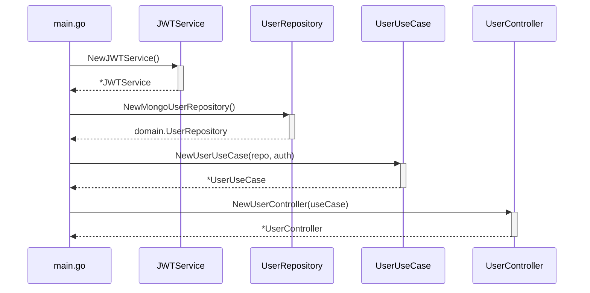

# Task Management API Clean Architecture Documentation

## Architectural Overview

### Layer Structure
```
task-manager/
├── Delivery/        # Framework-dependent HTTP handlers
├── Domain/          # Enterprise business rules
├── Infrastructure/  # Technical implementation details  
├── Repositories/    # Data access abstractions
└── Usecases/        # Application business rules
```

### Dependency Flow
```
HTTP Request → Delivery → Usecases → Domain ← Repositories
                                      ↑
                                 Infrastructure
```

## Key Design Decisions

### Why This Structure
1. **Separation of Concerns**: Each layer has single responsibility
2. **Testability**: Business logic is framework-agnostic
3. **Maintainability**: Clear boundaries between components
4. **Flexibility**: Easy to swap implementations (e.g., database, auth providers)

## Development Guidelines

### Adding New Features
1. **Start with Domain**:
   ```go
   // domain/new_feature.go
   type NewEntity struct {
       ID   primitive.ObjectID
       Name string
   }
   
   type NewRepository interface {
       Save(entity *NewEntity) error
   }
   ```

2. **Implement Use Case**:
   ```go
   // usecases/new_usecase.go
   type NewUseCase struct {
       repo domain.NewRepository
   }
   
   func (uc *NewUseCase) Create(name string) error {
       // Business logic here
   }
   ```

3. **Add Data Access**:
   ```go
   // repositories/new_repository.go
   type NewMongoRepository struct {
       collection *mongo.Collection
   }
   ```

4. **Create Delivery**:
   ```go
   // controllers/new_controller.go
   func (c *NewController) Create(ctx *gin.Context) {
       // Call use case
   }
   ```

## Packages

### Domain Layer (`/Domain`)
```go
// package domain contains core business entities and interfaces
// all other layers depend inward toward these definitions
//
// key principles:
// - no external dependencies
// - pure business interfaces
// - framework-agnostic models
package domain
```

### Usecase Layer (`/Usecases`)
```go
// package usecases implements application business rules
// 
// responsibilities:
// - orchestrate between repositories and domain entities
// - enforce business validations
// - never contain technical details (HTTP, DB, etc.)
package usecases
```

### Repository Layer (`/Repositories`)
```go
// package repositories provides data access implementations
//
// implementation Notes:
// - must satisfy domain repository interfaces
// - all DB operations go here
// - transaction management handled here
package repositories
```

## Dependency Initialization Flow



## Error Handling Strategy

| Error Type          | Handling Layer      | Example                   |
|---------------------|---------------------|---------------------------|
| Business Rule       | Usecase             | `ErrTaskNotFound`         |
| Data Access         | Repository          | MongoDB duplicate key     |
| Input Validation    | Controller          | Invalid date format       |
| Authentication      | Middleware          | Invalid JWT               |

## Authentication Notes
- All protected endpoints require JWT in Authorization header:
  ```http
  Authorization: <user_jwt_token>
  ```
- Token expiration: 24 hours
- First registered user automatically becomes admin

## Base URL
`http://localhost:8080/tasks`

## Endpoints

### 1. Register User
**Endpoint**: `POST /register`  
**Access**: Public  
**Description**: Creates a new user account  

**Request**:
```http
POST /register HTTP/1.1
Host: localhost:8080
Content-Type: application/json

{
  "username": "johndoe",
  "password": "secpass123"
}
```

**Validation Rules**:
- `username`: required, unique
- `password`: required, min 8 characters

**Response**:
- Success: `201 Created`
```json
{
  "message": "user created successfully"
}
```
- Error: `400 Bad Request`
```json
{
  "error": "username already exists"
}
```

### 2. User Login  
**Endpoint**: `POST /login`  
**Access**: Public  
**Description**: Authenticates user and returns JWT token  

**Request**:
```http
POST /login HTTP/1.1
Host: localhost:8080
Content-Type: application/json

{
  "username": "johndoe",
  "password": "secpass123"
}
```

**Response**:
- Success: `200 OK`
```json
{
    "token": "eyJhbGciOiJIUzI1NiIsInR5c...",
    "user": {
        "id": "687a5d6fd13206feebdc0901",
        "role": "admin",
        "username": "johndoe"
    }
}
```
- Error: `401 Unauthorized`
```json
{
  "error": "invalid credentials"
}
```

## Any **authenticated** user can perform the following operations

### 1. Get All Tasks
**Endpoint**: `GET /tasks`
**Access**: All authenticated users
**Description**: Retrieves all tasks from the system

**Request**:
```http
GET /tasks HTTP/1.1
Host: localhost:8080
Authorization: eyJhbGciOiJIUzI1NiIsInR5c...
```

**Response**:
- Status: `200 OK`
- Body:
```json
[
    {
        "id": "6878d8c9bab227206acc35e3",
        "title": "Implement unit testing for task management API",
        "description": "Implement comprehensive unit tests for the Task Management API to ensure the correctness and reliability of core business logic across all architectural layers (Use Cases, Repositories, and Infrastructure).",
        "due_date": "2025-07-25T18:00:00Z",
        "status": "pending"
    }
]
```

- Error: `401 Unauthorized` 
**Description**: This occurs when no authorization provided.
```json
{
    "error": "authorization header required"
}
```

### 2. Get Single Task
**Endpoint**: `GET /tasks/:id`
**Access**: All authenticated users
**Description**: Retrieves a specific task by ID
**Path Parameters**:
- `id` (required): Task ID 

**Request**:
```http
GET /tasks/6878d8c9... HTTP/1.1
Host: localhost:8080
Authorization: eyJhbGciOiJIUzI1NiIsInR5c...
```

**Response**:
- Success: `200 OK`
```json
{
    "id": "6878d8c9bab227206acc35e3",
    "title": "Implement unit testing for task management API",
    "description": "Implement comprehensive unit tests for the Task Management API to ensure the correctness and reliability of core business logic across all architectural layers (Use Cases, Repositories, and Infrastructure).",
    "due_date": "2025-07-25T18:00:00Z",
    "status": "pending"
}
```
- Not Found: `404 Not Found`
**Description**: This occurs when authorization provided, but no task registered with the id.
```json
{
    "error": "no task found with this id to see"
}
```

## Only an **admin** user can perform the following actions

### 1. Promote User to Admin  
**Endpoint**: `PUT /promote/:id`  
**Access**: Admin only  
**Description**: Promotes a user to admin role  
**Path Parameters**:
- `id` (required): User ID 

**Request**:
```http
PUT /promote/687a54b26707fb33a2e9d84d HTTP/1.1
Host: localhost:8080
Authorization: eyJhbGciOiJIUzI1NiIsInR5c...
```

**Response**:
- Success: `200 OK`
```json
{
  "message": "user promoted to admin successfully"
}
```
- Error: `403 Forbidden`
**Description**: This occurs when authorization provided, but the user is not an admin.
```json
{
  "error": "admin access required"
}
```

### 2. Create Task
**Endpoint**: `POST /tasks`
**Access**: Admin only
**Description**: Creates a new task

**Request**:
```http
POST /tasks HTTP/1.1
Host: localhost:8080
Content-Type: application/json
Authorization: eyJhbGciOiJIUzI1NiIsInR5c...

{
  "id": "6878d8c9bab227206acc35e3",
  "title": "Implement unit testing for task management API",
  "description": "Implement comprehensive unit tests for the Task Management API to ensure the correctness and reliability of core business logic across all architectural layers (Use Cases, Repositories, and Infrastructure).",
  "due_date": "2025-07-25T18:00:00Z",
  "status": "pending"
}
```

**Validation Rules**:
- `due_date`: ISO 8601 format
- `status`: must be `pending|in_progress|completed`

**Response**:
- Success: `201 Created`
```json
{
    "id": "6878d8c9bab227206acc35e3",
    "title": "Implement unit testing for task management API",
    "description": "Implement comprehensive unit tests for the Task Management API to ensure the correctness and reliability of core business logic across all architectural layers (Use Cases, Repositories, and Infrastructure).",
    "due_date": "2025-07-25T18:00:00Z",
    "status": "pending"
}
```
- Error: `403 Forbidden`
**Description**: This occurs when authorization provided, but the user is not an admin.
```json
{
  "error": "admin access required"
}
```

### 3. Update Task
**Endpoint**: `PUT /tasks/:id`
**Access**: Admin only
**Description**: Updates an existing task (full or partial update)
**Path Parameters**:
- `id` (required): Task ID 

**Request**:
```http
PUT /tasks/6878d8c9... HTTP/1.1
Host: localhost:8080
Content-Type: application/json
Authorization: eyJhbGciOiJIUzI1NiIsInR5c...

{
    "status": "in_progress",
}
```

**Response**:
- Success: `200 OK`
```json
{
    "message": "task updated successfully",
    "updated task": {
        "id": "6878d8c9bab227206acc35e3",
        "title": "Implement unit testing for task management API",
        "description": "Implement comprehensive unit tests for the Task Management API to ensure the correctness and reliability of core business logic across all architectural layers (Use Cases, Repositories, and Infrastructure).",
        "due_date": "2025-07-25T18:00:00Z",
        "status": "in_progress"
    }
}
```
- Error: `403 Forbidden`
**Description**: This occurs when authorization provided, but the user is not an admin.
```json
{
  "error": "admin access required"
}
```

### 4. Delete Task
**Endpoint**: `DELETE /tasks/:id`
**Access**: Admin only
**Description**: Deletes a task by ID
**Path Parameters**:
- `id` (required): Task ID (integer)

**Request**:
```http
DELETE /tasks/6878d8c9... HTTP/1.1
Host: localhost:8080
Authorization: eyJhbGciOiJIUzI1NiIsInR5c...
```

**Response**:
- Success: `200 Ok` (empty body)
```json
{
    "message": "task deleted successfully"
}
```
- Error: `403 Forbidden`
**Description**: This occurs when authorization provided, but the user is not an admin.
```json
{
  "error": "admin access required"
}
```

## Status Codes
| Code | Description |
|------|-------------|
| 200 | OK - Successful request, deletion |
| 201 | Created - Resource created |
| 400 | Bad Request - Invalid input |
| 401 |	Missing or invalid JWT token |
| 403 |	Insufficient permissions |
| 404 | Not Found - Resource not found |
| 500 | Internal Server Error |

## Task Status Values
- `pending` 
- `in_progress`
- `completed`

## Date Format
All dates must be in ISO 8601 format:  
`YYYY-MM-DDTHH:MM:SSZ`  
Example: `"2025-07-23T18:00:00Z"`

## Example Requests using curl

### Get All Tasks
```bash
curl -X GET http://localhost:8080/tasks
```

### Get Single Task
```bash
curl -X GET http://localhost:8080/tasks/{taskID}
```

### Create Task
```bash
curl -X POST http://localhost:8080/tasks \
  -H "Content-Type: application/json" \
  -d '{
      "title": "Implement unit testing for task management API",
      "description": "Implement comprehensive unit tests for the Task Management API to ensure the correctness and reliability of core business logic across all architectural layers (Use Cases, Repositories, and Infrastructure).",
      "due_date": "2025-07-25T18:00:00Z",
      "status": "pending"
}'
```

### Update Task
```bash
curl -X PUT http://localhost:8080/tasks/{taskID} \
  -H "Content-Type: application/json" \
  -d '{"status": "in_progress"}'
```

### Delete Task
```bash
curl -X DELETE http://localhost:8080/tasks/{taskID}
```

## Configuration Management Integration

### Prerequisites
1. Viper configuration library
2. `.env` file in project root (for local development)

### Required Packages
```bash
go get github.com/spf13/viper
```

### Key Features
- Supports both `.env` files and OS environment variables
- Type-safe access to config values (`GetString`, `GetInt`, etc.)
- Automatic uppercasing of env variable names
- Fail-safe operation (falls back to environment variables)

### Create .env file
- Inside `.env` file add:
  ```
  JWT_SECRET=your_secret_key
  ```

## Authentication Dependencies Integration

### Prerequisites
1. JWT support package
2. Bcrypt hashing package

### Required Packages
```bash
go get github.com/dgrijalva/jwt-go
go get golang.org/x/crypto/bcrypt
```

## MongoDB Go Driver Integration

### Prerequisites
1. MongoDB server (version 4.4+) running
2. Go installed
3. MongoDB Go driver package:
   ```bash
   go get go.mongodb.org/mongo-driver/mongo
   ```

### Configuration

#### Required Packages
```go
import (
    "go.mongodb.org/mongo-driver/mongo"
    "go.mongodb.org/mongo-driver/mongo/options"
    "go.mongodb.org/mongo-driver/bson"
    "go.mongodb.org/mongo-driver/bson/primitive"
)
```

### Connection Management

#### Establishing Connection
```go
clientOptions := options.Client().ApplyURI(MongoURI)
client, err := mongo.Connect(context.Background(), clientOptions)
```

#### Health Check
```go
// ping the database to verify connection
ctx, cancel := context.WithTimeout(context.Background(), 5*time.Second)
defer cancel()
err = client.Ping(ctx, nil)
```

#### Closing Connection
```go
ctx, cancel := context.WithTimeout(context.Background(), 10*time.Second)
defer cancel()
client.Disconnect(ctx)
```

### CRUD Operations

#### Document Structure
```go
type Task struct {
    ID              primitive.ObjectID     `bson:"_id,omitempty" json:"id"`
    Title           string                 `bson:"title" json:"title"`
    Description     string                 `bson:"description" json:"description"`
    DueDate         time.Time              `bson:"due_date" json:"due_date"`
    Status          string                 `bson:"status" json:"status" binding:"oneof=pending in_progress completed"`
}
```

#### Operation Timeouts
```go
ctx, cancel := context.WithTimeout(context.Background(), 5*time.Second)
defer cancel()
```

### Error Handling

#### Common Errors
- `mongo.ErrNoDocuments`: When no document matches query
- `mongo.CommandError`: For duplicate keys or validation errors
- `context.DeadlineExceeded`: For operation timeouts

